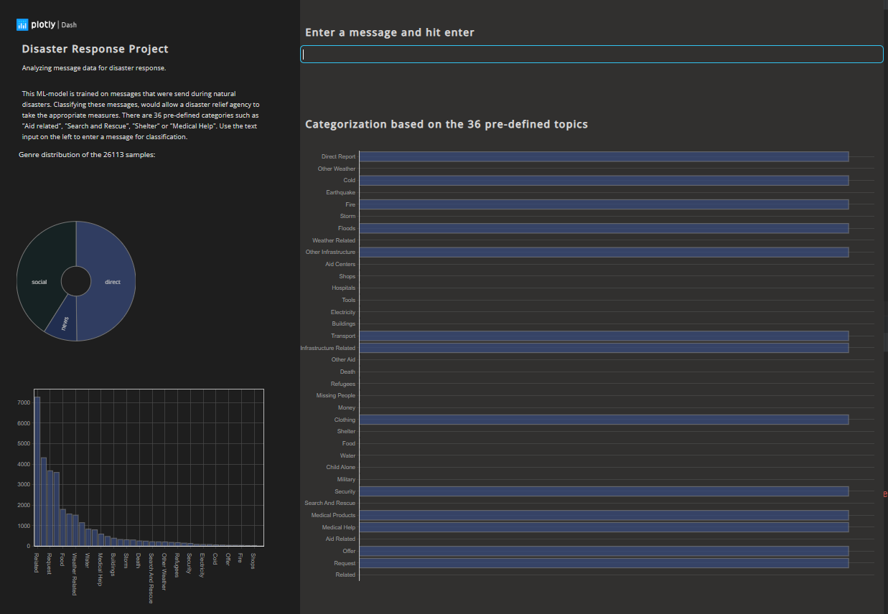

## Disaster Response Pipeline Project

### Introduction
In this project messaging data from Appen has been used to build a model for an API that classifies disaster 
messages.
The messages that were sent during disaster events are cleaned and organized in the pipline.

The project's goal is to create a machine learning pipeline to appropriately categorize messages to a disaster relief agency.
The project includes a web app where an emergency worker can input a new message and get classified results. 
A web app is deployed for easy interaction and displays additional data. The visualization is implemented as a 
plotly Dash app which is deployed [here](https://emergency-response-project.herokuapp.com/)
.  

## File Structure

`app.py` where the dash app lives  
`requirements.txt` python modules that will be installed onto Heroku at build  
`runtime.txt` simply tells Heroku (the Gunicorn HTTP server) which Python version to use  
`Procfile` tells Heroku what type of process is going to run (Gunicorn web process) and the Python app entrypoint (app.py)  
`/assets` this directory is to serve the CSS files and images. Generating the figures is done in `charts.py`  
`/data` this folder contains the raw input `csv files`, the `database file` as well as the `process_data.py`  
`/models` this folder contains the script to generate the model (`train_classifier.py`) as well as the model as a `Pickle file`  
`.gitignore` 

## Installation

### 1. Getting Started

- Change the current working directory to the location where you want the cloned directory

- Clone this repo to your local machine:

`$ git clone https://github.com/AReburg/ETL-Pipeline-Disasaster-Contact`
- Make sure that the app is running on the local webserver before attempting to deploy on Heroku.
Setup your virtualenv (or don't) and ensure you have all the modules installed before running the app. 

### 2. Requirements
Install the modules from the **requirements.txt** with pip3 or conda from a terminal in the project root folder

`pip3 install -r requirements.txt`  
`conda install --file requirements.txt` (Anaconda)
 

## Usage
### Prepare data and train the model

Run the following commands in the project's root directory to set up your database and model.

`python data/process_data.py data/disaster_messages.csv data/disaster_categories.csv data/DisasterResponse.db` runs the ETL pipeline that cleans data and stores in database

`python models/train_classifier.py data/DisasterResponse.db models/classifier.pkl` runs ML pipeline that trains classifier and saves

### Local web application
1. Run the app from your IDE direct, or from the terminal in the projects root directory: `python app.py`

2. It should be visible on the browser via `http://localhost/:8050`

3. Open the app in the browser and start playing around

### Conclusion
Due to the highly unbalanced dataset the results are not good enough for a commercial application. 
There are two ways to get a better outcome. Manually inspect all the messages and hand-label them for more details.
or  build an unsupervised pipeline. The advantages of an unsupervised application are that no labeling
is necassary and it is less time-consuming. Results will be automatically clustered.

can be seen from test data visualization most of the classes (categories) are highly imbalanced. This affects model F1 prediction score. One using this project should take this into consideration and apply measures like synthetic data generation, model selection and parameters fine-tuning, etc.

## Authors, Acknowledgements
[Appen](https://appen.com/) made this data set available to Udacity for training purposes.